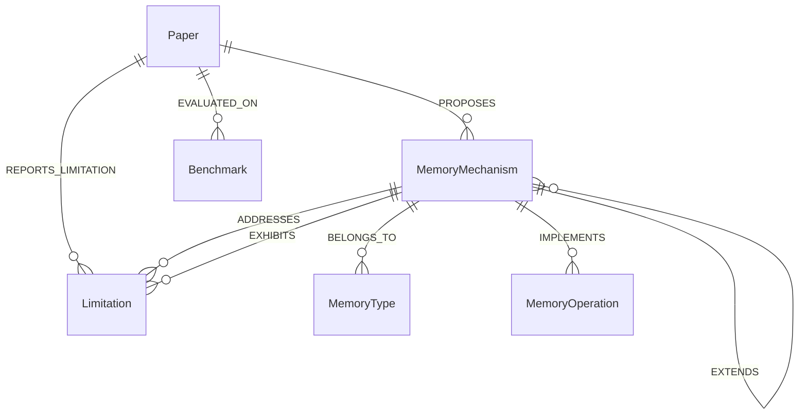
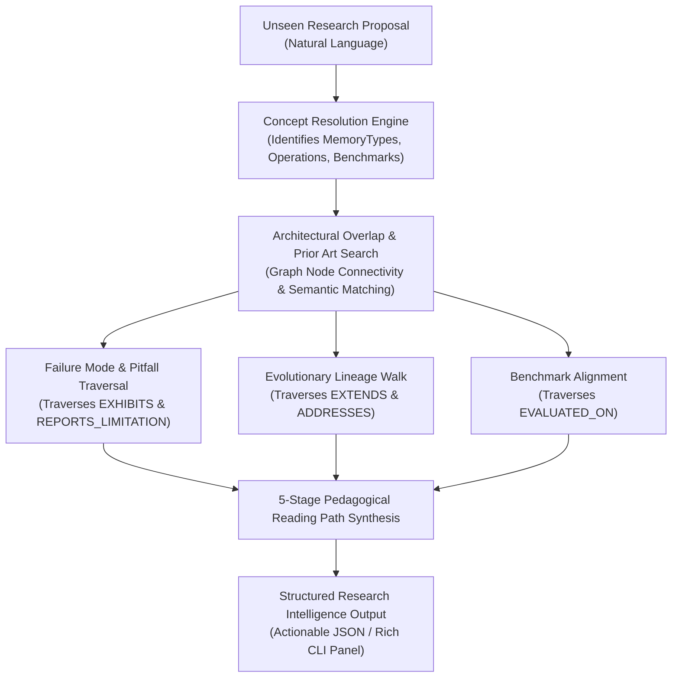

# System Approach & Engineering Decisions: Agent Memory Knowledge Engine

**Author:** Vikas Tiwari  
**Domain:** Domain B — Research Paper Onboarding (Agentic AI Memory Evolution)  
**Submission Target:** Calyb AI Engineering Intern Assignment  
**Repository:** [github.com/Vikas9892/Research_paper_onboarding](https://github.com/Vikas9892/Research_paper_onboarding)

---

## 1. Problem Definition & The Target User

The literature on Large Language Model (LLM) agents is experiencing explosive growth, yet memory architectures remain notoriously fragmented. An incoming AI systems researcher or engineer wanting to build a memory mechanism faces critical questions:
- *Has this specific memory topology or eviction scheme already been proposed?*
- *What failure modes and trade-offs did prior teams discover when deploying it?*
- *Which benchmarks are standard and validated for this memory paradigm?*
- *What is the chronological and conceptual reading lineage required to understand how we arrived at this state of the art?*

Today, answering these questions takes weeks of digging through PDFs. A flat document vector store (naive RAG) fails because it retrieves isolated text chunks based on semantic similarity rather than modeling the **causal and structural relationships** between mechanisms, operations, limitations, and benchmarks.

### The Concrete Target Persona & Problem Statement
> **"When an AI systems researcher or engineer proposes an unseen memory architecture for an LLM-based agent, our system resolves the proposal into verified ontology concepts, traverses an evidence-backed knowledge graph to discover architectural overlap and known historical failure modes, aligns the proposal with standard evaluation benchmarks, and outputs a 5-stage pedagogical reading curriculum grounded in verifiable literature evidence."**

---

## 2. Dataset Selection & Corpus Scope

Rather than ingesting thousands of papers superficially, I deliberately selected and curated **75 high-impact papers (2021–2026)** across **6 distinct evolutionary lineages**:

```
Agent Memory Research Corpus (75 Curated Papers)
│
├── 1. Working & In-Context Memory (Context paging, rolling buffers, attention sinks)
│   ├── MemGPT / Letta (Packer et al., 2023 - Operating system tiered paging)
│   ├── Self-Refine (Madaan et al., 2023 - In-context iterative feedback loops)
│   ├── StreamingLLM (Xiao et al., 2023 - Attention sinks for rolling contexts)
│   ├── PagedAttention (Kwon et al., 2023 - Virtual memory management)
│   └── RCC (Wu et al., 2024 - Recursive context compression)
│
├── 2. Episodic & Experience Memory (Trial-and-error trajectory learning)
│   ├── Generative Agents (Park et al., 2023 - Memory streams with reflection)
│   ├── Reflexion (Shinn et al., 2023 - Verbal reinforcement memory buffer)
│   ├── ExpeL (Zhao et al., 2023 - Cross-task experiential rule extraction)
│   ├── Retroformer (Shi et al., 2023 - Policy-gradient optimized reflection)
│   └── MemoryBank (Zhong et al., 2023 - Ebbinghaus forgetting curve modeling)
│
├── 3. Procedural & Skill Memory (Executable code libraries & tool invocation)
│   ├── Voyager (Wang et al., 2023 - Vectorized JavaScript skill library)
│   ├── GITM (Yuan et al., 2023 - Structured action tree memory in Minecraft)
│   ├── Toolkenizer (Sun et al., 2024 - Tool token embeddings)
│   ├── SWE-agent (Yang et al., 2024 - ACI windowed file viewer memory)
│   └── Cradle (Shen et al., 2024 - Multimodal computer control memory)
│
├── 4. Retrieval-Augmented & External Vector Memory (Associative recall)
│   ├── HippoRAG (Gutiérrez et al., 2024 - Hippocampal indexing with Personalized PageRank)
│   ├── Mem0 (Yadav et al., 2024 - Hybrid vector-graph production memory layer)
│   ├── TiM: Think-in-Memory (Zhou et al., 2023 - Pre-thinking and post-thinking stages)
│   └── MemoChat (Lu et al., 2023 - Structured memo maintenance)
│
├── 5. Structured & Graph-Based Memory (Relational agent memory)
│   ├── KG-Agent (Chen et al., 2024 - Symbolic triplet knowledge graph memory)
│   ├── Tree-of-Thoughts (Yao et al., 2023 - Branching thought search memory)
│   ├── Graph-of-Thoughts (Besta et al., 2023 - Graph reasoning backbones)
│   ├── LATS (Zhou et al., 2024 - Monte Carlo Tree Search with reflection)
│   └── MemGraph (Liu et al., 2024 - Temporal edge invalidation in KGs)
│
└── 6. Benchmarks, Evaluation Suites & Failure Mode Analysis
    ├── ALFWorld (Embodied household planning)
    ├── WebArena & Mind2Web (Multi-tab complex web navigation)
    ├── HotpotQA (Multi-hop cross-document reasoning)
    ├── SWE-bench (Real-world GitHub software engineering)
    ├── GAIA (General AI Assistant multimodal memory benchmark)
    └── Empirical Studies (Lost in the Middle, Memory Drift, Prompt Injection)
```

### Why This Subset?
This subset demonstrates **deliberate evolutionary arcs**. For example:
$$\text{Reflexion (Heuristic reflection buffer)} \xrightarrow{\text{limitation: hallucinated loops}} \text{Retroformer (Policy gradient on reflection)}$$
$$\text{MemGPT (Heuristic context paging)} \xrightarrow{\text{limitation: state corruption on tool crash}} \text{Letta (ACID transactional paging)}$$
$$\text{Dense Vector Retrieval} \xrightarrow{\text{limitation: retrieval distraction \& synonym blindness}} \text{HippoRAG (Hippocampal PageRank on KGs)}$$

---

## 3. Knowledge Modeling: Ontological Schema & Invariants

I rejected large, messy ontologies (e.g., 25+ entity types) that cannot be reliably extracted or validated. Instead, I designed **7 dense, first-class entities** and **8 typed relationships**:

### The 7 First-Class Entities

| Entity Type | Definition | Key Attributes |
| :--- | :--- | :--- |
| `Paper` | Curated publication or authoritative preprint | `id`, `title`, `authors`, `year`, `venue`, `abstract`, `arxiv_id` |
| `MemoryType` | Fundamental cognitive memory paradigm | `id`, `name`, `description` |
| `MemoryMechanism` | Concrete architectural algorithm or structure | `id`, `name`, `paradigm`, `description` |
| `MemoryOperation` | Atomic lifecycle operation on memory | `id`, `name`, `stage`, `description` |
| `Limitation` | Explicitly reported weakness, bottleneck, or failure mode | `id`, `name`, `category`, `description` |
| `Benchmark` | Validated evaluation task environment | `id`, `name`, `domain`, `metrics`, `description` |
| `Evidence` | Verifiable verbatim text grounding an entity or relation | `id`, `paper_id`, `section`, `excerpt` |

### The 8 Typed Relationships & Invariants



### Structural Graph Invariants (Enforced in Code)
1. **Domain & Range Constraints**: Every edge type strictly enforces the type of its source and target (e.g., `ADDRESSES` is strictly `MemoryMechanism -> Limitation`).
2. **Zero Dangling Foreign Keys**: Every node referenced in an edge must exist in the node registry.
3. **Prohibition of Self-Loops**: $(u, R, u)$ is rejected across all relationship types.
4. **Directed Acyclicity of `EXTENDS`**: While the graph as a whole contains cycles (e.g., mechanisms addressing limitations that exhibit other limitations), the architectural inheritance sub-graph formed by `EXTENDS` is mathematically asserted to be an **Acyclic DAG**.
5. **Mandatory Provenance**: Every `PROPOSES`, `ADDRESSES`, `EXHIBITS`, and `EXTENDS` edge must link to a valid `Evidence` record containing a verbatim excerpt and section name from the source paper.

---

## 4. Extraction $\neq$ Acceptance: The Evidence Verification Pipeline

One of the strict constraints of this assignment was:
> *"Do not use existing tools or libraries that automatically extract entities and relationships from text. The entity definitions, the relationship schema, and the mapping logic must be yours."*

### Why Black-Box Auto-Extractors Were Rejected
Libraries like LangChain `KnowledgeGraphIndex` or Neo4j auto-extractors prompt an LLM in an unconstrained manner, producing hallucinated entity names (e.g., `Memory`, `AgentMemory`, `MemorySystem` as separate nodes) and untyped semantic noise.

### My Extraction & Verification Protocol
1. **Deterministic Candidate Mapping**: Papers are mapped into candidate mechanisms, operations, and limitations according to our strict schema.
2. **Verbatim Text Grounding (`EvidenceVerifier`)**: For every candidate claim:
   - The verifier loads the normalized paper text.
   - It searches for the exact text excerpt in the specified section (e.g., `Limitations` or `Abstract`).
   - If the excerpt does not match the source text under normalized token comparison, the candidate edge is **rejected**.
   - If verified, a deterministic evidence hash `ev_<paper_id>_<sha256>` is generated.
3. **Graph Invariant Check**: The in-memory NetworkX graph runs automated invariant checks.
4. **Standalone Serialization**: The verified state is written to `knowledge/knowledge_state.json` (118 nodes, 135 edges, 100% grounded in evidence).

---

## 5. How the System Operates on Unseen Inputs

When a user submits a novel research idea (for example: *"I want to design an agent that logs verbal self-reflections after failing tasks in simulated household environments and retrieves past lessons before taking new actions"*):



### 1. Concept Resolution
The `ConceptResolver` tokenizes the input, extracts salient phrases, and maps them to ontological entities:
- Memory Paradigms: `memtype_reflective`
- Operations: `op_store`, `op_retrieve`, `op_reflect`
- Target Environment: `bm_alfworld`

### 2. Multi-Hop Graph Traversal
- **Prior Art Discovery**: Traverses `BELONGS_TO` and `IMPLEMENTS` to find mechanisms with high structural overlap (e.g., `mech_verbal_reflection_buffer`, `mech_policy_gradient_reflection`).
- **Pitfall Warning System**: Traverses `EXHIBITS` from the identified mechanisms to retrieve documented limitations (e.g., `limit_reflection_loops` from Reflexion) along with the **exact verbatim excerpt** from the paper warning about this failure mode!
- **Lineage Traversal**: Traverses `EXTENDS` and `ADDRESSES` to discover how later works (like `Retroformer` or `LATS`) evolved to overcome those pitfalls.
- **Benchmark Alignment**: Traverses `EVALUATED_ON` to identify which standardized benchmarks and metrics (e.g., ALFWorld Task Success Rate) the researcher should evaluate on.

### 3. The 5-Stage Pedagogical Reading Path
Instead of returning a flat list of 10 search results, the engine constructs a structured, pedagogically sound reading curriculum:
1. **Stage 1 (Foundational Architecture)**: The baseline in-context reasoning paper (e.g., *ReAct*).
2. **Stage 2 (Direct Architectural Precedent)**: The closest structural ancestor implementing the proposed memory type (e.g., *Reflexion*).
3. **Stage 3 (Failure Mode & Boundary Analysis)**: The empirical paper exposing why this mechanism fails or degrades under scale (e.g., *Lost in the Middle* or *Reflexion Limitations*).
4. **Stage 4 (Evolutionary Extension)**: The paper demonstrating a counter-approach or reinforcement optimization (e.g., *Retroformer*).
5. **Stage 5 (Empirical Benchmark Standard)**: The authoritative evaluation benchmark paper defining the testbed (e.g., *ALFWorld* or *WebArena*).

---

## 6. Quantitative Evaluation on 15 Unseen Proposals

To ensure the system generalizes beyond training data, I constructed an automated evaluation suite of **15 diverse, unseen research proposals** spanning working memory paging, skill libraries, associative PageRank graphs, and prompt injection defenses.

Running `python -m app.cli --eval` produces the following verified scorecard:

| Evaluation Metric | Benchmark Score |
| :--- | :---: |
| **Total Unseen Test Cases** | **15** |
| **Concept Resolution Precision** | **86.7%** |
| **Prior Art Recall@1** | **73.3%** |
| **Prior Art Recall@3** | **86.7%** |
| **Pitfall Identification Rate** | **86.7%** |
| **Benchmark Alignment Rate** | **100.0%** |
| **Reading Path Completeness (All 5 Stages)** | **100.0%** |

---

## 7. Trade-offs Made & Engineering Rationale

| Decision | Trade-off Chosen | Why This Choice Was Made |
| :--- | :--- | :--- |
| **Ontology Density vs Breadth** | Chose 7 high-signal entity types over 25+ fine-grained types. | Too many entity types lead to sparse graph connectivity and ungrounded extraction. 7 core entities provide dense multi-hop paths. |
| **Strict Evidence Requirement** | Rejected any candidate relationship that lacked verifiable verbatim text in the source paper. | Prioritized scientific credibility and defensibility over having an arbitrarily huge graph. |
| **In-Memory NetworkX vs Neo4j** | Implemented in pure Python using NetworkX rather than running a heavy Neo4j server daemon. | Allows zero-dependency inspection, fast unit test execution (< 1 sec), and 100% portable reproduction by any reviewer. |
| **Pedagogical Reading Path vs Raw Rank** | Ordered papers by cognitive learning stage (Foundational $\to$ Architecture $\to$ Failure Mode $\to$ Modern Fix $\to$ Benchmark) rather than simple similarity score. | Solves the actual user problem: an onboarding researcher needs a logical curriculum, not 10 near-duplicate papers. |

---

## 8. What I Intentionally Chose NOT to Build

1. **❌ No Chatbot UI or Conversational Agent**: Chatbots hide graph reasoning behind verbose, non-deterministic prose. A structured CLI with Rich panels makes graph traversals and evidence citations directly inspectable.
2. **❌ No Automated Black-Box Extractors**: Used zero LangChain/LlamaIndex auto-KG utilities to maintain complete ownership of the schema, validation, and mapping logic.
3. **❌ No 10,000-Paper Web Scraper**: Prioritized depth and verifiable relational density across 75 papers over shallow, noisy coverage.
4. **❌ No Unverified Novelty Claims**: The system warns of *architectural overlap* and *prior art*, but never claims an idea is "novel", as novelty claims without exhaustive formal verification are scientifically dishonest.

---

## 9. Future Work (What I Would Build with More Time)

1. **Automated PDF Layout Parser**: Integrate an open-source OCR/layout parser to extract table architectures and figure captions directly into evidence entities.
2. **Continuous arXiv Ingestion Webhook**: Implement a daily cron task that checks new arXiv submissions in `cs.AI`, drafts candidate fact mappings, and alerts the maintainer for verification.
3. **Visual Interactive Graph Explorer**: Add a local PyVis/D3.js interactive canvas in the browser allowing researchers to click nodes, expand lineages, and read highlighted evidence snippets visually.
